#### 科技胜利战报

0 锤猴子
2 文化蘑菇
4 金钱蘑菇
5 锤猴子；猴1出门左转探路
6 亚述
8 叉子蘑菇；传统开门
9 畜牧蘑菇；锤猴子；猴2盯亚述
10 印尼
11 西奈（Mt.Sinai）
12 亚述一分
13 人口蘑菇；自主开门
15 抢工人
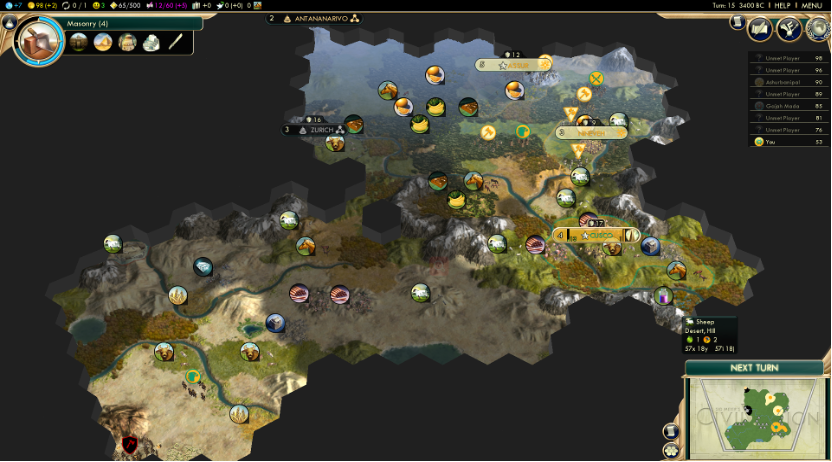
16 文化蘑菇；锤猴子
19 锤大金；科技补完远古前排
22 猴3出门右转抢索菲亚工人，随后出门探路
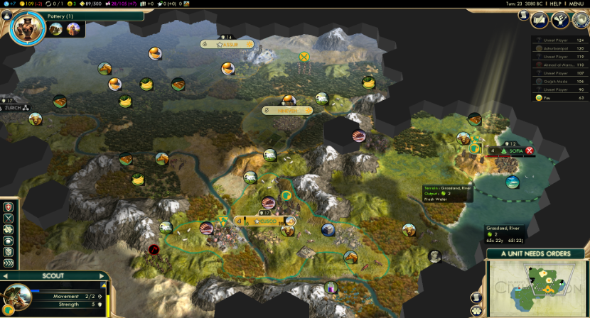
24 换到埃及的棉花
26 大图飞走
29 首都5人口，锁锤
33 大平顶山（The Grand Mesa）
34 移民政策
37 大金完成，锤叉子；猴1叉子卡ZOC堵截亚述移民；拉古萨连铜管任务完成
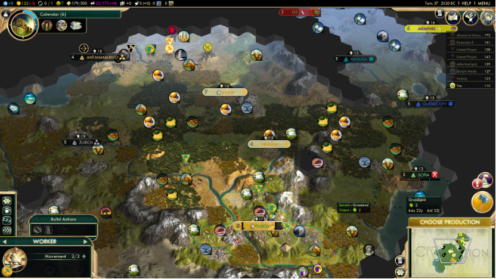
38 一分落地
39 摩洛哥宣友
40 亚述围攻一分，锤弓；移民到手，回一分
42 攻城塔出现，叉子去站桩；亚述2棒子即将撞死在城下；摩洛哥不远万里来清寨子；锤第一个移民
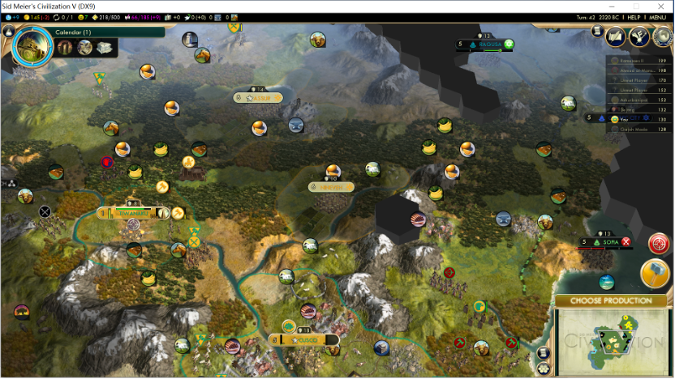
45 换到摩洛哥的松露（truffles）；铁矿开好，卖铁
47 拿下攻城塔，小弓回首都护送移民；卡位索菲亚第2个工人和亚述第3个工人；远古后排科技还差航海、书写和捕猎；首都溢出小弓
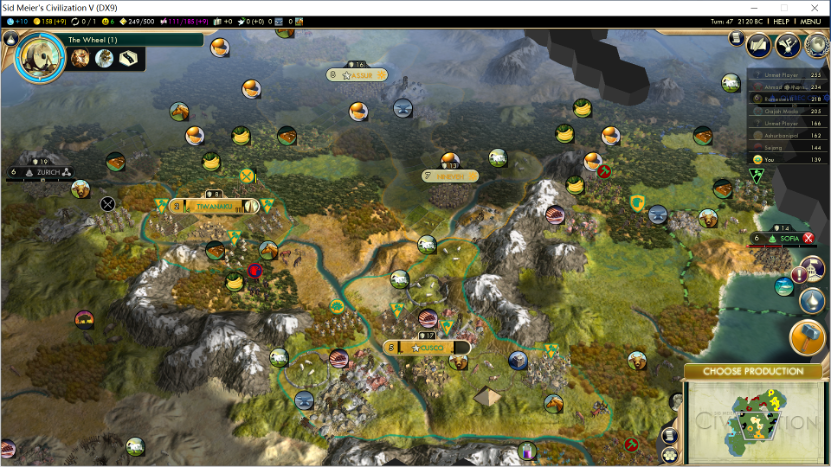
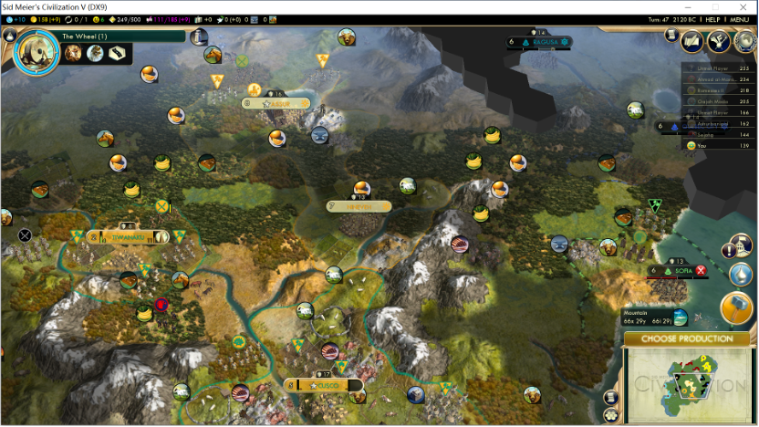
48 完成魁北克的连通马匹任务；开始吃产能惩罚；科技走建造
50 埃及和亚述联宣摩洛哥
52 二分抢先印尼一步坐下；两小弓完成苏黎世（Zurich）的寨子任务
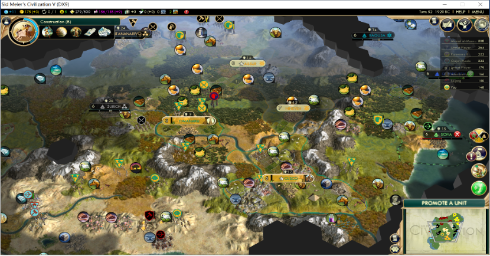
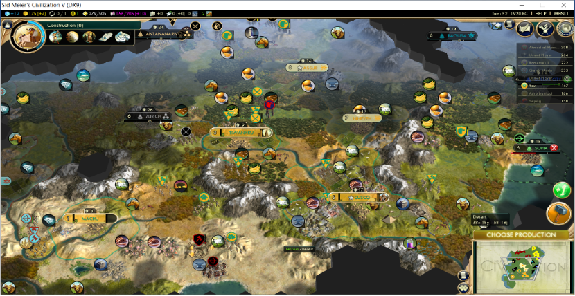
54 溢骆驼；小弓们回一分压制亚述；续约埃及的棉花
57锤完骆驼，做苏黎世的商路任务；三分移民到位，但笑脸不够；工人政策
58 同盟苏黎世，三分坐下；朝鲜（Sejong，世宗李裪）宣友
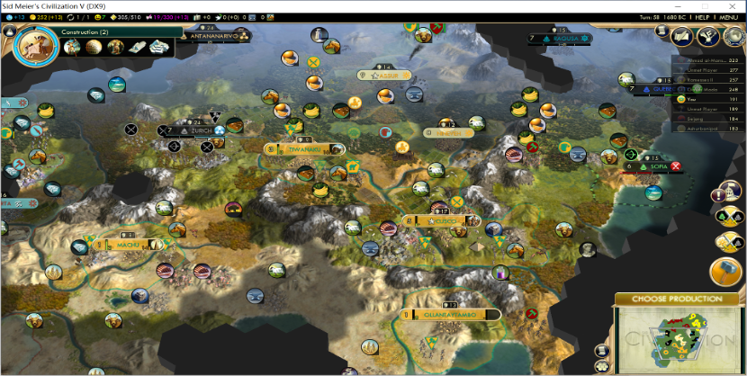
60 建造学完成，科技走数学
61 印尼军队集结，一分补叉子，调兵去二分；小弓升复合
62 出四分移民，溢复合
63 印尼宣战
64 亚述愿意赔2gpt
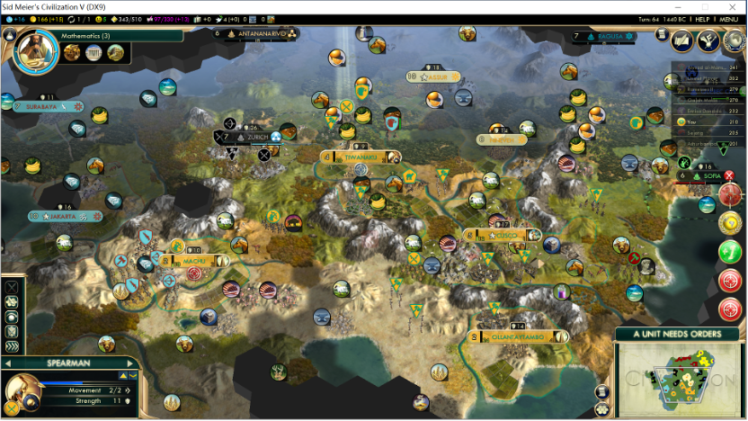
65 首都再出一复合
67 数学完成，科技走工程学，四分坐下
68 工人开始连道路；亚述愿意赔6gpt；四分炮击索菲亚工人，工人没动作；等猴子回满血
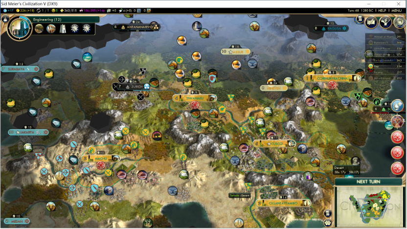
70 抢索菲亚第3个工人；猴子侥幸没死；遇到拜占庭，换到白银
72 印尼撤军，追击
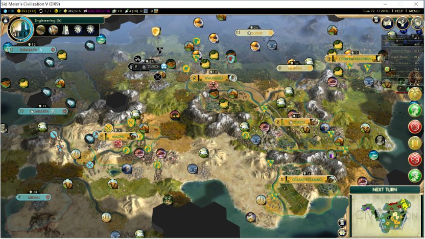
76 溢出石工坊；大军出生；一叉一复合回家压制亚述
78 印尼愿意赔款1gpt；亚述2攻城塔现身四分；完成工程学，科技补书写、捕猎、航海、光学；完成塔那那利佛的连通宝石任务
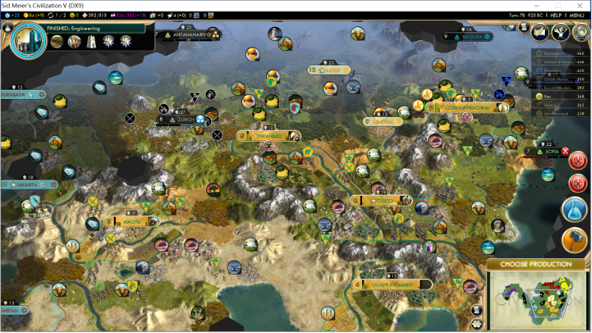
80 可可卖给摩洛哥换钱，四分买出1猴挡路；精英政策；五分落地（先出政策再落地）
82 六分落地
85 抢印尼工人和小仙，用小仙勾兵
86 亚述愿意割让一分，笑脸不够，先劫掠地块
88 亚述停战，割尼尼微
90 牺牲猴子抢索菲亚第4个工人
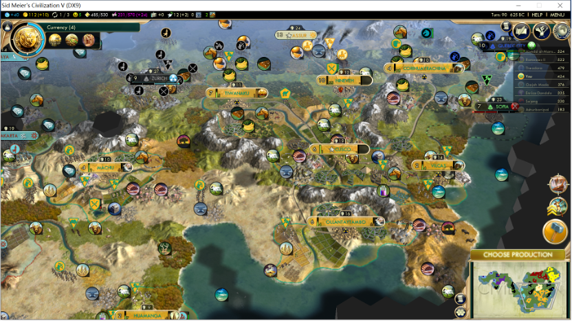
94 大军拍走索菲亚的铁、牛和可可，与之停战
101 科技2回合溢出文官；抢印尼第2个工人（总数12）；全国道路连通
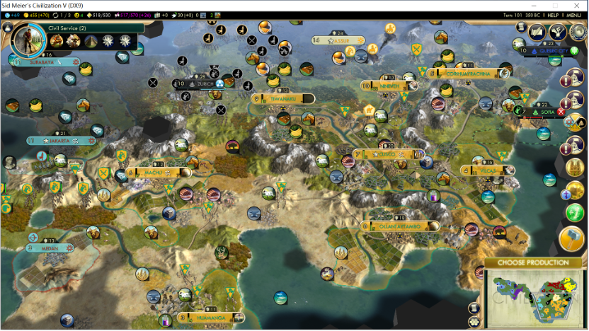
103 文官制度；自产黄金；代议政策
108 吞并尼尼微（加2红脸，另外每3人口加1红脸）
109 威尼斯进启蒙，间谍去威尼斯；印尼愿意割小城；出文学家工会
110 换到摩洛哥的食盐
115 教育制度；6t开下个政策，11t偷到银行，拆纪念碑延缓政策速度
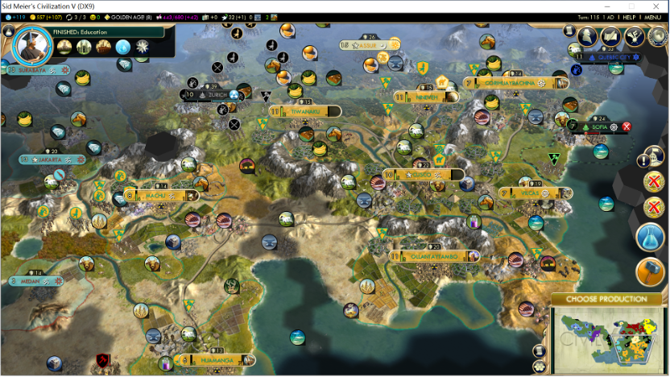
122 签摩洛哥250RA
125 偷银行业，进启蒙
126 理性开门
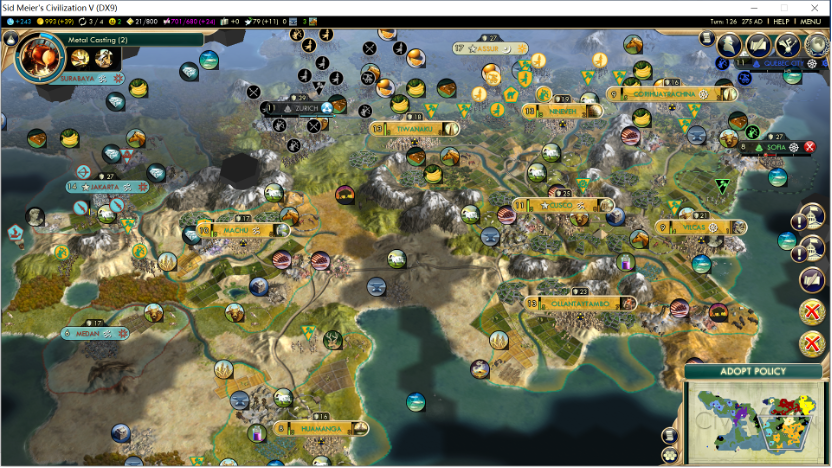
134 印刷术；首都完成国立
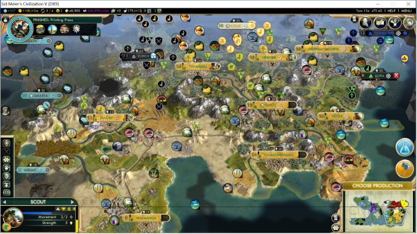
135 一会，提案世博
137 威尼斯宣友
138 拜占庭宣友
140 泰尔被威尼斯吞并（红脸3回合），笑脸压力大，各城锤动物园
142 与印尼停战，其城市质量低，改收割赔款（221+38gpt）；
146 工业化完成
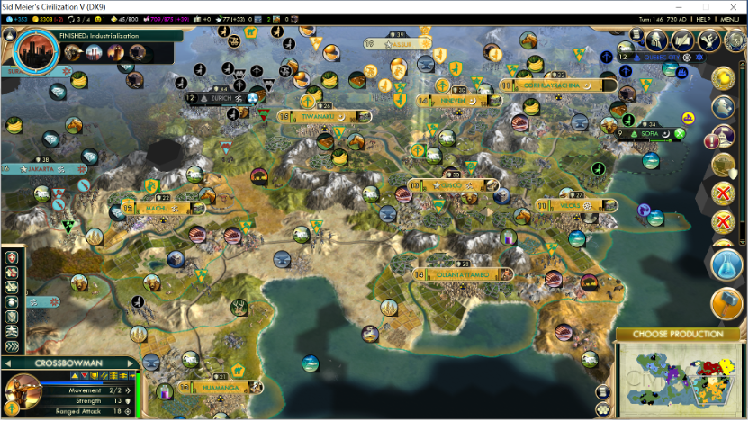
147 艺术家公会
149 开好煤炭，买三工厂
150 自由政策：公民社会、伟人加速；理性左一
152 RA加速科学方法
154 科学方法完成，离世博十几回合，开锤公立
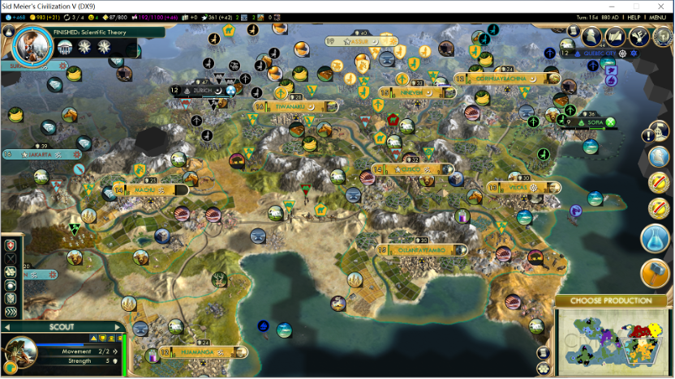
155 印尼宣友；至此除埃及、亚述外，全部互相宣友
166 准备普及公立
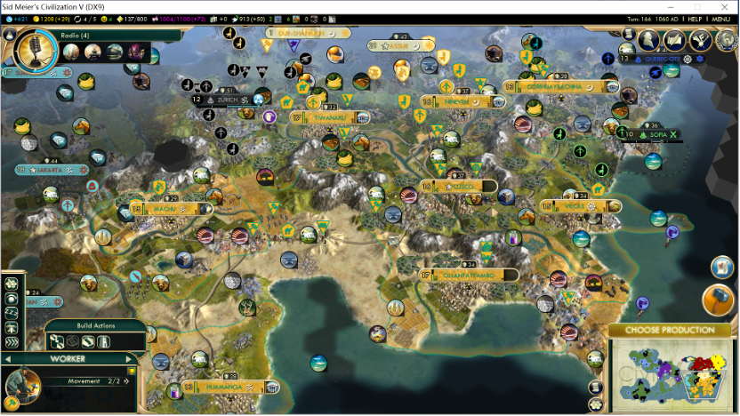
168 开锤世博；二级自由政策：普选制度
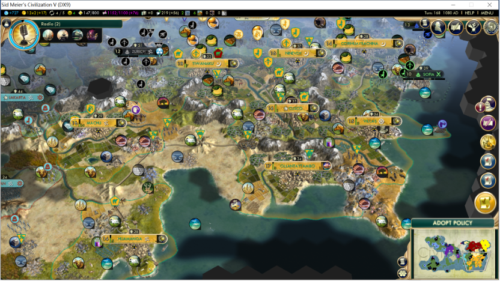
174 世博会完成，免费政策点商业开门；基建落后的几个城市提前开始锤建筑；世博黄金差2点数
175 世博黄金，大艺全部烧掉；科技冲塑料；城市补天文台、证交所等
177 一级自由政策：资本主义
178 出第3个大文；大工秒大本钟
182 对亚述搞事：谴责、阻止铺城、拍大军
183 烧3大文（烧的当回合点开政策界面，可以直接开政策）：理性右一右二左二
184 印尼谴责亚述
186 威尼斯、摩洛哥谴责亚述；大工秒自由女神像
187 二级自由政策：志愿军，准备收割亚述赔款（亚述有30+的gpt）；出自由女神像，免费政策点太空船采购；拜占庭、朝鲜谴责亚述
188 亚述发外交警告（边境调兵），开战，否则会有背信弃义的外交惩罚
191 塑料，调人口憋峰值1760
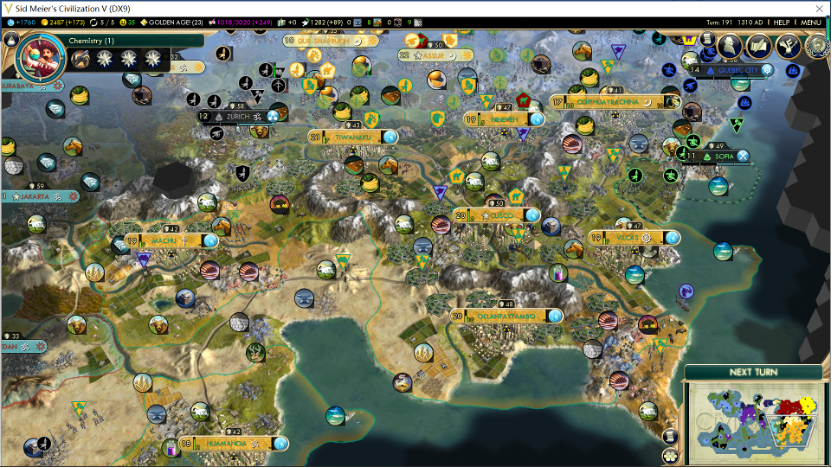
194 埃及三工厂开秩序
199 第3个大艺；与亚述停战；烧1大科秒航空，下回合出弹道（当前5个大科，3t后再出一个）；割亚述一城，卖给摩洛哥109gpt；威尼斯当前4500+500gpt，可以晚一点再借钱
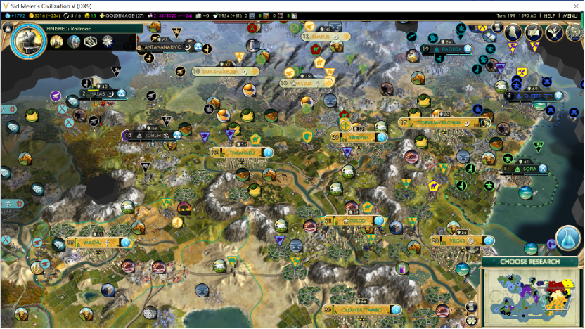
200 烧1大科秒电子，下回合出雷达
205 威尼斯和埃及进入现代
209 机器人学完成；理性关门秒纳米；2鸽子大科
210 朝鲜进现代
214 最后一个自产大科；哈勃差1t、牛津差1t、科技差3个

8城科研成本：7854-9856-11858-13552
