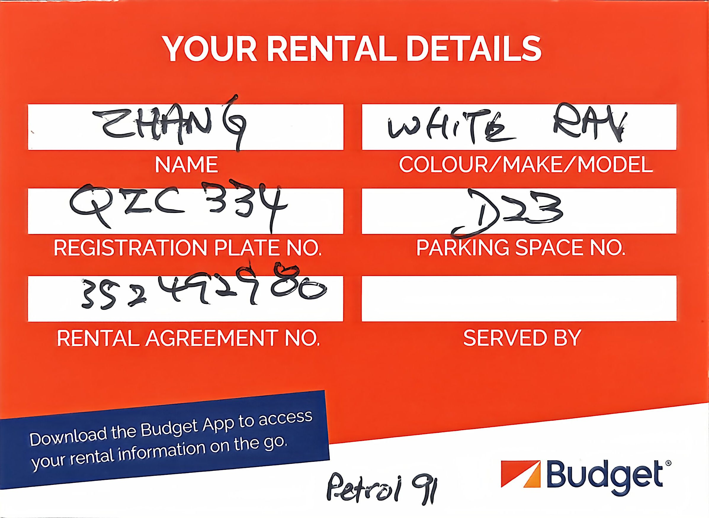
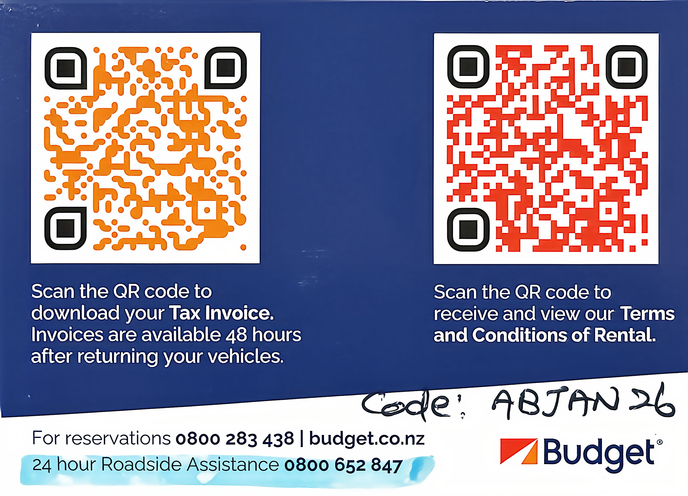

#### 本次租车信息

车型：丰田 RAV 4

颜色：白色

车牌：QZC334

租约编号：352492980

油号：91号汽油

24小时道路救援 (Roadside Assistance)：0800 652 847

道路救援优惠码：ABJAN26

#### 攻略

常用租车平台：Apex、Ezi、Avis、Hertz、Budget、Europcar

建议购买全险+零起赔额，需注意不能驶入非铺装路面，否则保险自动失效。

基督城机场到达口对面即为租车公司服务专区，直接排队办理手续。

新西兰为右舵驾驶（靠左行驶），过路口时容易混淆。

南岛无过路费，部分停车区收费，需在路边机器缴费。

##### 加油

加油站通常为自助，先刷信用卡授权，启动油泵，再取下加油枪加油。

- 格林诺奇 (Glenorchy)：2.86 NZD/L

